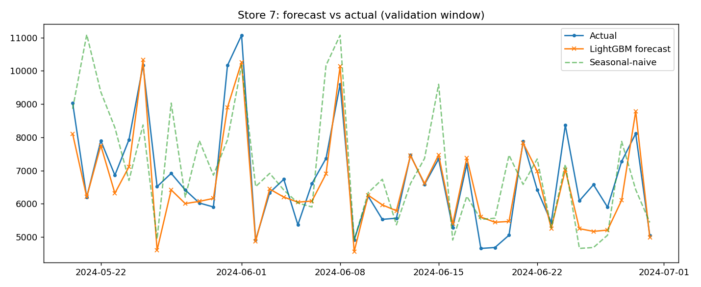
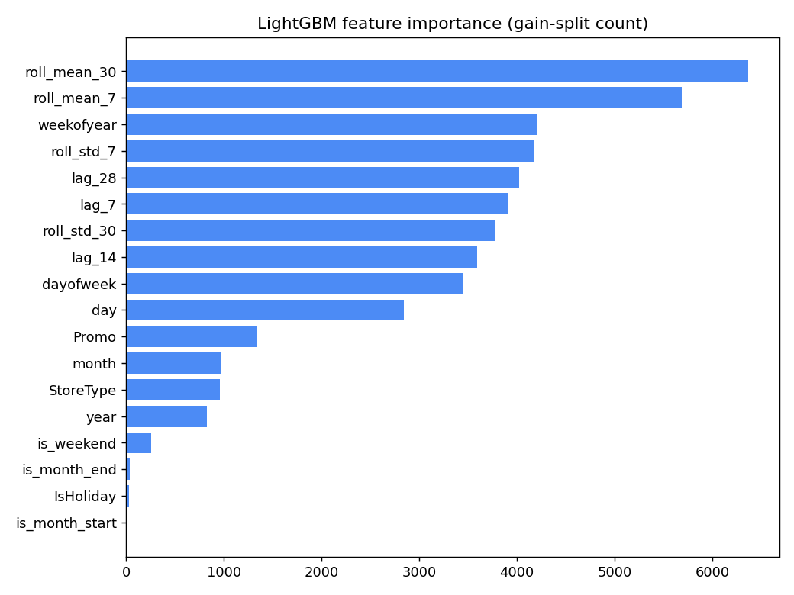

# Sales Demand Forecasting

Daily store-level sales forecasting on the real **Rossmann Store Sales** dataset (1M+ records, 1,115 stores), built with a deliberately **leakage-free, time-aware** methodology and benchmarked against a seasonal-naive baseline.

The emphasis here is not on a fancy model — it is on doing the boring parts correctly: past-only features, a chronological train/validation split, and every result reported as an **improvement over a baseline** rather than as an absolute number in a vacuum.


---

## Headline results

XGBoost on the real Rossmann data, evaluated on the most recent 6 weeks (held out chronologically):

| Model | RMSE | MAE | MAPE |
| --- | ---: | ---: | ---: |
| Seasonal-naive baseline | 3,063 | 2,418 | 37.6% |
| **XGBoost** | **949** | **658** | **10.0%** |
| **Improvement** | **−69.0%** | **−72.8%** | **−27.6 pts** |

Top demand drivers (by feature importance): **rolling sales averages, promotions, and day-of-week**.

> The scikit-learn `HistGradientBoostingRegressor` variant on the same real data lands within a point of this (RMSE −68.6%, MAPE 10.1%), confirming the gains come from the features and methodology, not a single library.

---

## What's in the repo

| File | What it is |
| --- | --- |
| `demand_forecasting_xgboost.ipynb` | **Main notebook.** XGBoost on the real Rossmann data, end-to-end with the results above. |
| `demand_forecasting_rossmann.ipynb` | Same real data, using scikit-learn's `HistGradientBoostingRegressor` (no native build step). |
| `demand_forecasting_sklearn.ipynb` | **Zero-download version.** Runs the full pipeline on synthetic Rossmann-style data so you can reproduce it without a Kaggle account. |
| `demand_forecasting.py` | Standalone script (LightGBM) of the same pipeline — load → features → time split → baseline → model → metrics → plots. |
| `generate_data.py` | Generates the synthetic dataset (`store_sales.csv.gz`) with realistic trend, weekly/yearly seasonality, promos, and holidays. Seeded for reproducibility. |
| `rossmann-store-sales/` | The real Kaggle Rossmann files (`train.csv`, `store.csv`, `test.csv`, `sample_submission.csv`). |
| `feature_importance.png`, `forecast_vs_actual.png` | Output plots from a run. |

---

## Results at a glance

**Forecast vs. actual** for a sample store over the validation window — XGBoost tracks the weekly pattern far more tightly than the seasonal-naive line:



**Feature importance** — temporal signals (rolling means and lags) and promotions dominate:



---

## Methodology (why the number is trustworthy)

Forecasting is one of the easiest places to accidentally leak the future into your features and report a score that collapses in production. This pipeline guards against that explicitly:

- **Open days only.** Rows where the store was closed (`Open == 0`) are dropped — forecasting zero sales on a known closure isn't the task.
- **Past-only features.** Lag features (`lag_7/14/28`) and rolling statistics (`roll_mean/std` over 7- and 30-day windows) are computed **per store** and shifted so the current day is never part of its own rolling window. Rows without enough history (the first 28 days per store) are dropped rather than back-filled.
- **Time-aware split — never shuffled.** The model trains on the past and validates on the most recent 6 weeks. A random split would let the model "see" future weeks of a store it's predicting, inflating the score.
- **A real baseline.** The seasonal-naive baseline ("same weekday last week", i.e. `lag_7`) is the bar to beat. Every metric is reported as a percentage improvement over it, because beating a strong naive baseline is the only thing that proves the model adds value.
- **MAPE ignores zero-actuals** to avoid divide-by-zero blowups.

### Features used

Calendar: `dayofweek`, `day`, `month`, `year`, `weekofyear`, `is_weekend`, `is_month_start`, `is_month_end`
Business: `Promo`, `IsHoliday`, `StoreType`
Temporal: `lag_7`, `lag_14`, `lag_28`, `roll_mean_7`, `roll_std_7`, `roll_mean_30`, `roll_std_30`

---

## Getting started

### Option A — run instantly, no data download (synthetic)

```bash
git clone https://github.com/mannatrajsingh/Sales-Demand-Forecasting.git
cd Sales-Demand-Forecasting
pip install pandas numpy scikit-learn matplotlib

python generate_data.py        # creates the synthetic store_sales dataset
# then open demand_forecasting_sklearn.ipynb, or run the script:
python demand_forecasting.py    # uses LightGBM: pip install lightgbm
```

### Option B — the real Rossmann data (headline results)

1. Get the Rossmann Store Sales data (Kaggle: *Rossmann Store Sales* competition) and place `train.csv` and `store.csv` in `rossmann-store-sales/`.
2. Open **`demand_forecasting_xgboost.ipynb`** and run all cells.

```bash
pip install xgboost pandas numpy scikit-learn matplotlib
```

### Run on Google Colab

The notebooks run as-is on a free Colab instance:

[Open the main notebook in Colab »](https://colab.research.google.com/github/mannatrajsingh/Sales-Demand-Forecasting/blob/main/demand_forecasting_xgboost.ipynb)

> **Heads-up on data files:** the pipeline only needs a CSV with columns `[Store, Date, Sales, Promo, Open, StoreType, IsHoliday]`. Rossmann's `train.csv` already has these, so you can point the loader at it with no other changes.


